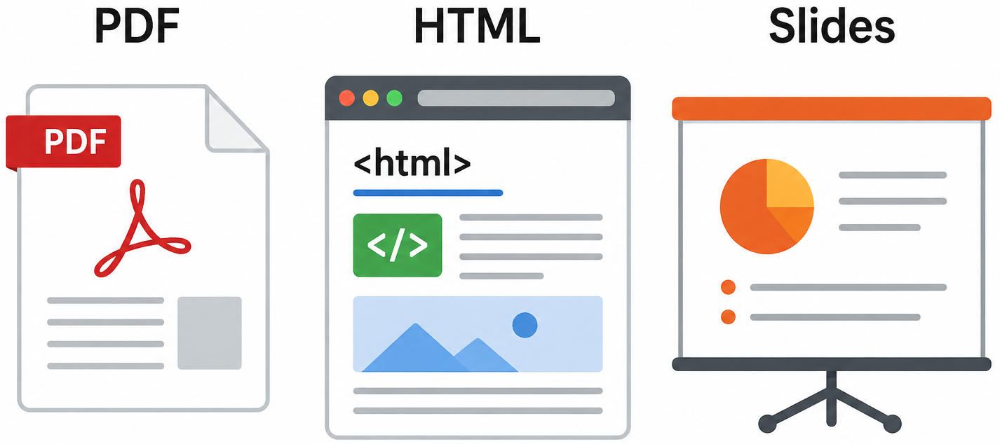
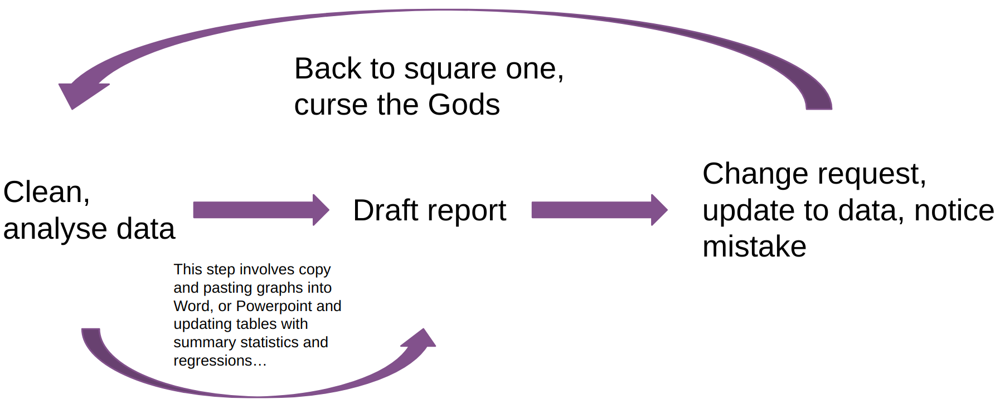

## Github.com/MadAtmeh/LPQ {style="text-align: center;"}

# Literate Programming


Is a programming approach that combines code and explanation in a single document. It prioritizes programs to be written for **humans** *first* then **machines** *second*.

**Motivation**: 
{fig-align="center"}

# Quarto

Is an open-source publishing system  that supports literate programming by combining **code**, **text**, and **output** in a single document.
It allows users to create:
{fig-align="center" width="990px" height="300px"}

## History: Literate Programming

It was Introduced in the early 1980s by **Donald Knuth**

- Computer scientist and author of *The Art of Computer Programming*.

- Developed the concept while writing the book *The TeXbook* and building the **TeX system**.

- Formalized in his work: Literate Programming (1984) supported alongside tools like **WEB** (for Pascal) and **CWEB** (for C).

- Advocated that programming is a form of communication and storytelling.

## Why Literate Programming Matters

- Improves **reproducibility** (results can always be regenerated)

- Reduces **errors** from copying code or manual steps

- Makes analysis **easier to understand and share**

- Combines **thinking + coding + reporting**

- Saves time in long-term projects

##  Where is Literate Programming Used?

- Data science reports

- Academic research papers

- Business dashboards & analytics

- Scientific experiments

- Coursework & assignments

## The Problem

{fig-align="center" width="990px" height="400px"} 

This leads to **repetitive work, high error risk, poor reproducibility and extremely time-consuming**.


## Core Concept: Literate Programming

Literate programming is the idea of combining:

- **code** (what you run)

- **data** (what you analyze)

- **output/analysis** (results like tables or plots)

- **documentation** (explanations in plain language)

**= All in one single document**

## Example: Understanding Literate Programming

```
# Documentation:
# This example analyzes student scores to understand overall performance.

# Data:
scores <- c(70, 75, 80, 90, 95)

# Code:
average <- mean(scores)

# Output:
average

# Analysis:
# The average score is 82, indicating that students performed well overall.
```

##  Historical Tools & Evolution

Early tool: **Sweave**

It combines **R** and **LaTeX**, allowing users to embed code directly within documents for reproducible research.
<br><br>

Evolution: **Knitr**

Sweave later evolved into knitr, which improved *usability*, *flexibility*, and overall *performance*. This evolution enabled:

- Easier customization

- Better integration of code, results and narrative text

## Modern Tools

**Quarto**

The latest in literate programming for **R** is a new tool developed by Posit. It is designed to make creating dynamic documents easier and more organized. It supports:

- R

- Python

- Julia

# Using Quarto with R 

## Step 1: Install required software:

**1. R** – A programming language for data analysis

**2. RStudio**  – An easy-to-use interface for writing R code and working with documents

**3. Quarto** – A tool to create documents that combine text, code, and results

**4. Git** (optional) – Helps track changes and manage versions of your work

## Step 2: Install required R Packages:

- **tidyverse** - for data analysis
install.packages("tidyverse")

- **knitr** - for rendering
install.packages("knitr")

- **rmarkdown** - for markdown setup
install.packages("rmarkdown")

- **tinytex** - for PDF support
install.packages("tinytex") + tinytex:install_tinytex()

## Running these commands in R

Simply run these commands in an R console to get started:

```
install.packages("tidyverse")
install.packages("knitr")
install.packages("rmarkdown")
install.packages("tinytex")

# Install TinyTeX (for PDF rendering)
tinytex:install_tinytex()

# Load libraries
library(tidyverse)
library(knitr)
library(rmarkdown)
library(tinytex)
```
## Markdown Ultrabasics

| Feature       | Syntax Example           | Description            |
| ------------- | ------------------------ | ---------------------- |
| Heading 1     | `# Heading`              | Main title             |
| Heading 2     | `## Heading`             | Section                |
| Heading 3     | `### Heading`            | Subsection             |
| Italic        | `*text*` or `_text_`     | Italic text            |
| Bold          | `**text**` or `__text__` | Bold text              |
| Strikethrough | `~~text~~`               | Deleted text           |
| Underline     | `<ins>text</ins>`        | Underlined text (HTML) |

## Quarto File Structure (.qmd)

A **Quarto** document (.qmd) is made up of:

- **YAML header** → metadata (title, format, author)
- **Markdown text** → written explanation
- **Code chunks** → executable analysis

Overall, it combines **text**, **code**, and **results** in one file.

## Code Chunks
Are sections where executable code is written inside a document. 
This is the core feature of literate programming. They allow:

- Code execution inside the document

- Reproducible results

- Combined explanation + output

## Code Chunk Options

You can control how code appears using options:
<br><br>


| Option           | Effect                       |
| ---------------- | ---------------------------- |
| `echo: false`    | Hide code                    |
| `eval: false`    | Do not run code              |
| `warning: false` | Hide warnings                |
| `message: false` | Hide messages                |

##  Purpose: Code Chunk Options

These options are used to:

- Improve readability
- Clean up output
- Focus on results instead of code
- Customize document appearance

##  Example: Code Chunks I

1. Content Chunk

```
## What is Literate Programming?
- Programming is a form of communication  
- Code and explanation are written together  
```

2. Code Chunk

```
scores <- c(70, 80, 90)
mean(scores)

```


3. Analysis chunk

```
## Average Score Example

scores <- c(70, 75, 80, 90, 95)
mean(scores)

```
##  Example: Code Chunks II

4. Image Chunk 
```
{fig-align="Position"}
```

5. Speaker Notes 

```
::: notes
Emphasize that the goal is readability, not just execution.
:::
```

## Data Analysis Workflow in R
<br>
This is the standard workflow in R for data analysis.

**Import Data** → load data using ```read_csv()```

**Clean Data** → use dplyr to filter and transform data

**Analyze Data** → apply statistical methods

**Visualize Data** → create plots using ggplot2

## Full Code Demo

```
# -----------------------------
# Documentation:
# This example analyzes student exam scores to understand class performance.
# We compute summary statistics and visualize the distribution.

# -----------------------------
# Data:
scores <- c(55, 62, 70, 75, 80, 85, 90, 95, 100)

# -----------------------------
# Code:
mean_score <- mean(scores)
median_score <- median(scores)
sd_score <- sd(scores)

# -----------------------------
# Output:
mean_score
median_score
sd_score

# -----------------------------
# Visualization:
hist(scores,
     main = "Distribution of Student Scores",
     xlab = "Scores",
     col = "lightblue",
     border = "white")

# -----------------------------
# Analysis:
# The average score gives an overview of class performance.
# The median shows the central tendency without being affected by extreme values.
# The standard deviation shows how spread out the scores are.
# Overall, the class performance is strong with moderate variation.
```
## Exercise 

- **Task 1:** Use the same structure from the demonstration code to analyze a new set of student scores.
<br>

New Dataset:
scores <- c(48, 52, 67, 73, 78, 81, 88, 92, 96)

- **Task 2:** Visualize the data.

# Thank you for Listening! {style="text-align: center;"}
